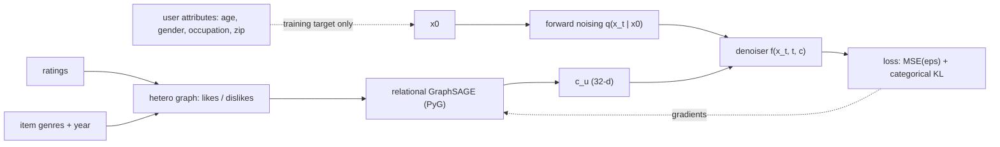
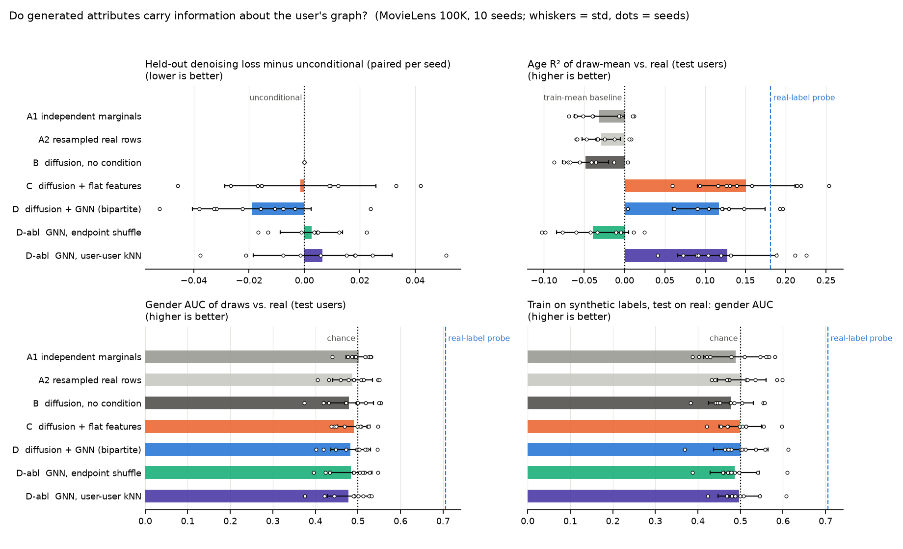

# Graph-Conditioned Diffusion for Heterogeneous Data

A small, controlled study of one question:

> Does conditioning a diffusion model on graph-derived structural representations improve the fidelity or downstream usefulness of generated heterogeneous data, compared with diffusion without graph conditioning?

Pipeline studied: mixed-type user records + a user-item rating graph → GNN encoder → structural embedding → mixed-type diffusion model. Data: MovieLens 100K. The diffusion model (Gaussian for numeric columns, multinomial for categorical ones) is written out by hand in [`src/gcdiff/diffusion.py`](src/gcdiff/diffusion.py) so the forward process, timestep handling, denoiser, conditioning, loss and sampler are all readable.

**Main result:** behavioural conditioning helps generate age-related signal, but
the GNN does not outperform the matched flat-feature encoder overall. It has
lower held-out denoising loss, while flat conditioning has higher mean age R²;
categorical fidelity remains weak.

Author: Farzam Nikbakhsh Jorshari (nikbakhshfarzam@gmail.com). MSc portfolio project; not peer reviewed.



## What is compared

| | Method |
|---|---|
| A1 / A2 | non-generative: independent marginals / resampled real rows (noise floor and copying reference) |
| B | unconditional diffusion |
| C | diffusion conditioned on **flat** behaviour features (no graph) |
| D | diffusion conditioned on a **GNN** over the bipartite user-item graph |
| ablations | D on a **user-degree-preserving endpoint shuffle**; D on a user-user **kNN** graph |

The graph never sees the generated attributes (user nodes carry only log-degrees); a unit test checks this.

## Results (executed; 10 seeds, CPU; `results/quick_10seeds/`)

Values are the mean ± sample standard deviation across ten random seeds. These
runs reuse the same 943 users and therefore are not independent population
samples or confidence intervals.

| Method | Held-out denoising loss ↓ | Age R² of draws ↑ | Gender AUC of draws ↑ (chance 0.5) | Association error ↓ |
|---|---|---|---|---|
| B unconditional | 0.491 ± 0.026 | −0.048 ± 0.029 | 0.478 ± 0.058 | 0.099 ± 0.025 |
| C flat features | 0.489 ± 0.023 | **0.151 ± 0.061** | 0.490 ± 0.038 | 0.127 ± 0.017 |
| D GNN | **0.472 ± 0.016** | 0.117 ± 0.058 | 0.483 ± 0.047 | 0.108 ± 0.020 |
| D, endpoint shuffle | 0.493 ± 0.023 | −0.039 ± 0.045 | 0.484 ± 0.049 | 0.103 ± 0.020 |
| D, kNN graph | 0.498 ± 0.022 | 0.128 ± 0.062 | 0.478 ± 0.050 | 0.138 ± 0.024 |



What the data support (details, caveats and the full tables are in [`docs/research_note.md`](docs/research_note.md)):

* GNN and flat conditioning make generated **ages** informative about real age (R² 0.117 and 0.151 vs −0.048 unconditional; both improvements occur in 10/10 seeds), and probes trained on synthetic ages transfer to real users.
* The GNN's age signal **disappears under the endpoint shuffle** (R² −0.039). The kNN graph has similar age R² to the bipartite GNN but worse denoising loss and association error, so graph-construction conclusions depend on the metric.
* **No overall evidence that the GNN beats flat-feature conditioning.** GNN minus flat age R² is −0.034 ± 0.075 (5/10 seeds), although GNN held-out loss is lower in 10/10 seeds. The comparative hypothesis is not supported at this scale.
* **Gender is not recovered by any diffusion variant** (AUC 0.48–0.49, versus 0.706 for a linear probe on the same features). Likely cause (untested): the categorical loss is about 25× smaller than the numeric loss.
* Marginals and attribute-attribute association are not improved by conditioning. No gross copying was detected, **which is not a privacy claim**.

The final configuration is shared by all diffusion methods, but it was adjusted
after inspecting a one-seed development run. The reported evaluation uses
disjoint seeds; the study remains exploratory rather than confirmatory.

## Quick start

```bash
git clone https://github.com/DrNFRZM/graph-conditioned-diffusion.git
cd graph-conditioned-diffusion
pip install torch --index-url https://download.pytorch.org/whl/cpu      # or your CUDA build
pip install -e ".[dev]"

python -m pytest                                                        # 28 tests: no network, no GPU
python -m gcdiff.run --config configs/quick.yaml --out results/my_quick # CPU, 3 seeds, about 10 min; downloads MovieLens 100K (~5 MB) to ./data
```

* Reproduce the reported table: add `--seeds 1000 1001 1002 1003 1004 1005 1006 1007 1008 1009` and `--out results/quick_10seeds` (about 30 min on a 12-thread CPU).
* `configs/full.yaml` (T = 250, up to 600 epochs, 64 draws per user) is provided for CUDA/longer runs and has **not been executed**; no results are claimed for it.
* Regenerate figures from saved CSVs: `python -m gcdiff.plots results/quick_10seeds`.
* Every run writes `config.yaml`, `env.json`, per-seed CSV, summary, paired differences and training curves. Seeds control the split, initialisation, noise and sampling. An independent repeat of seed 1000 matched all 27 non-runtime fields exactly in this CPU environment; GPU determinism was not checked.

## Repository map

```
src/gcdiff/
  diffusion.py   schedule, forward process, Gaussian + multinomial posteriors, loss, sampler
  models.py      denoiser (FiLM), flat / hetero-GNN / kNN-GNN encoders
  graphs.py      hetero graph, edge shuffle, kNN graph, label-free behaviour features
  data.py        download + SHA-256 check, tables, codec, node splits
  train.py       AdamW, deterministic validation loss, early stopping
  metrics.py     fidelity, association, TSTR, conditional consistency, DCR, homophily
  experiment.py  seeds x methods -> results;   run.py CLI;   plots.py figures
tests/           28 tests incl. posterior-vs-Bayes checks and a leakage test
configs/         quick.yaml (CPU), full.yaml (CUDA / longer)
docs/            research_note, diffusion_explained, design_decisions, interview_guide, learning_roadmap
results/         quick_10seeds/ (executed), diagnostics/
scripts/         diagnose_categorical_dependence.py
```

## Documentation

* [Research note](docs/research_note.md): design, results, interpretation, checks, limitations.
* [Diffusion explained](docs/diffusion_explained.md): the mathematics, mapped to the code.
* [Design decisions](docs/design_decisions.md): alternatives, metric validity table, threats to validity.
* [Interview guide](docs/interview_guide.md): 17 hard questions with answers.
* [Learning roadmap](docs/learning_roadmap.md): four-week reading/experiment plan.

## Data

MovieLens 100K, F. M. Harper and J. A. Konstan, "The MovieLens Datasets: History and Context", ACM TiiS 5(4), 2015, DOI 10.1145/2827872. Source: <https://grouplens.org/datasets/movielens/100k/> (file: <https://files.grouplens.org/datasets/movielens/ml-100k.zip>). GroupLens distributes the dataset under its own [usage terms](https://files.grouplens.org/datasets/movielens/ml-100k-README.txt), including attribution, non-redistribution and non-commercial-use conditions. Therefore **the data are downloaded at run time and are not included in this repository.** No credentials are needed.

## Scope and caveats

* Small-data study (943 users): effects are modest and noisy; see the threats to validity.
* Synthetic data are **not** claimed to be private. The copying check is a sanity check only; there is no membership-inference evaluation and no differential privacy.
* Inferring demographic attributes from behaviour is ethically sensitive; this is a benchmark exercise.

## Citation and licence

See [`CITATION.cff`](CITATION.cff). Code: MIT ([`LICENSE`](LICENSE)); the licence does not cover MovieLens.
