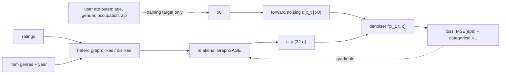
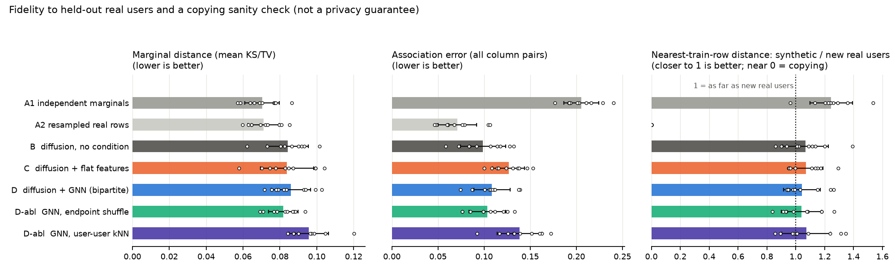

# Research note: does graph conditioning help a mixed-type diffusion model?

Farzam Nikbakhsh Jorshari (nikbakhshfarzam@gmail.com). Small controlled study; not a thesis chapter and not a submitted paper. All numbers below come from `results/quick_10seeds/` and were produced by the code in this repository (see `env.json`). One final configuration is shared across methods, but it was adjusted after the outputs of a one-seed development run had been viewed. The reported run uses disjoint evaluation seeds 1000–1009. This makes the study exploratory, not a preregistered confirmatory test; details are in §5.

## 1. Question

> Does conditioning a diffusion model on graph-derived structural representations improve the fidelity or downstream usefulness of generated heterogeneous data, compared with diffusion without graph conditioning?

Motivation: many pipelines flatten heterogeneous data into a vector before generation; a graph can keep relationships explicit. This study asks the narrowest testable version of that on one public dataset.

## 2. Setup in brief

* **Data.** MovieLens 100K (GroupLens): 943 users, 1,682 items, 100,000 ratings. Age mean 34.1, std 12.2; 71% male; 21 occupations; 795 distinct zip codes. Downloaded at run time, SHA-256 verified.
* **Generated object.** A user profile: `age` (numeric), `gender` (2), `occupation` (21), `zip_region` (11).
* **Graph.** Heterogeneous bipartite user-item graph, relations `likes` (rating >= 4, 55% of ratings) and `dislikes`, both directions. Item nodes: genres + release year. User nodes: log-degree per relation only. **No user attribute enters the graph.**
* **Encoder.** 2-layer relational GraphSAGE (PyG `HeteroConv` + `SAGEConv`), output 32-d, trained end-to-end through the diffusion loss.
* **Diffusion.** Hand-written. Gaussian DDPM (ε-prediction) for age, multinomial diffusion for categoricals, cosine schedule, T = 100, FiLM-conditioned residual MLP (see [diffusion_explained.md](diffusion_explained.md)).



| Label | Method | What it isolates |
|---|---|---|
| A1 | independent marginal resampling (non-generative) | marginals right, dependence destroyed |
| A2 | resampled real train rows (non-generative) | real-data noise floor; maximal copying |
| B | unconditional diffusion | value of any conditioning |
| C | diffusion conditioned on flat behaviour features (41-d, MLP encoder) | "flattening" baseline: same information at depth 1, no graph |
| D | diffusion conditioned on the bipartite-graph GNN | the hypothesis |
| D-abl-1 | GNN on a **user-degree-preserving endpoint shuffle** | item-endpoint identity beyond preserved user activity (structural control) |
| D-abl-2 | GNN on a **user-user kNN graph** (cosine on flat features, k = 10) | graph construction |
| ref | logistic / ridge probe on flat features with **real** labels | simple discriminative reference (not an upper bound) |

Protocol: user-level split 60/15/25 (train/val/test), stratified by gender; 10 evaluation seeds (1000–1009), each with a new split and initialisation; identical hyper-parameters for every diffusion variant (`configs/quick.yaml`). Validation loss is used only for early stopping. Test users' attributes are never seen by any generator; test users' ratings are in the graph (transductive; discussed in [design_decisions.md](design_decisions.md)). For evaluation, 32 draws are generated per test user and one draw per train user. Age preprocessing for the TSTR-table metric is fitted on the real training partition, not the test set.

## 3. Results (10 seeds, mean ± sample standard deviation over seeds)

The seed-to-seed spread measures sensitivity to splits and initialisation. The
ten runs reuse the same 943 users, so these values are neither independent
population samples nor confidence intervals.

Full tables: `results/quick_10seeds/summary.csv`, per-seed `metrics_per_seed.csv`, paired differences `paired_deltas.csv`.

### 3.1 Does the generated data carry information about the user's graph?

| Method | Held-out denoising loss ↓ | Age R² of draw-mean ↑ | Gender AUC of draws ↑ | TSTR-node age R² ↑ | TSTR-node gender AUC ↑ |
|---|---|---|---|---|---|
| A1 independent marginals | – | −0.031 ± 0.031 | 0.502 ± 0.030 | −0.078 ± 0.169 | 0.488 ± 0.074 |
| A2 resampled rows | – | −0.029 ± 0.024 | 0.487 ± 0.046 | −0.053 ± 0.068 | 0.503 ± 0.057 |
| B unconditional | 0.491 ± 0.026 | −0.048 ± 0.029 | 0.478 ± 0.058 | −0.119 ± 0.115 | 0.478 ± 0.053 |
| C flat features | 0.489 ± 0.023 | **0.151 ± 0.061** | 0.490 ± 0.038 | **0.131 ± 0.031** | 0.500 ± 0.051 |
| D GNN (bipartite) | **0.472 ± 0.016** | 0.117 ± 0.058 | 0.483 ± 0.047 | 0.074 ± 0.060 | 0.501 ± 0.064 |
| D-abl endpoint shuffle | 0.493 ± 0.023 | −0.039 ± 0.045 | 0.484 ± 0.049 | −0.074 ± 0.062 | 0.486 ± 0.058 |
| D-abl kNN graph | 0.498 ± 0.022 | 0.128 ± 0.062 | 0.478 ± 0.050 | 0.101 ± 0.049 | 0.497 ± 0.050 |
| ref: linear probe, real labels | – | 0.182 ± 0.039 | 0.706 ± 0.025 | (same) | (same) |

*Age R²* is measured against the train-mean predictor (0 = no better than the mean). *Gender AUC* has chance level 0.5, and its null standard deviation per seed is about 0.04 with 236 test users. *TSTR-node*: a probe is trained on the **synthetic** labels of train users and evaluated on **real** test users.

Paired differences over seeds (from `paired_deltas.csv`; "k/10" = number of seeds in which the first method is better):

| Comparison | Age R² | Held-out loss | TSTR-node age R² | Association error |
|---|---|---|---|---|
| GNN − unconditional | +0.165 ± 0.044 (10/10) | −0.019 ± 0.021 (9/10 lower) | +0.194 ± 0.108 (10/10) | +0.010 (worse in 8/10) |
| flat − unconditional | +0.199 ± 0.055 (10/10) | −0.001 ± 0.027 (5/10 lower) | +0.250 ± 0.120 (10/10) | +0.028 (worse in 10/10) |
| GNN − endpoint shuffle | +0.156 ± 0.040 (10/10) | −0.022 ± 0.016 (9/10 lower) | +0.148 ± 0.063 (10/10) | +0.005 |
| GNN − kNN graph | −0.011 ± 0.056 (5/10) | −0.026 ± 0.010 (10/10 lower) | −0.027 ± 0.089 (3/10) | −0.030 (better in 10/10) |
| **GNN − flat** | **−0.034 ± 0.075 (5/10)** | **−0.018 ± 0.013 (10/10 lower)** | −0.057 ± 0.068 (flat better in 7/10) | −0.018 (GNN better in 10/10) |


### 3.2 Fidelity to held-out real users, and a copying sanity check

| Method | Marginal distance ↓ (mean KS/TV) | Association error ↓ | TSTR-table AUC ↑ (gender from age/occ/zip) | DCR ratio (≈1 = no closer to train than new users) | Exact-match rate to a train row |
|---|---|---|---|---|---|
| A1 independent marginals | 0.070 ± 0.009 | 0.206 ± 0.019 | 0.479 ± 0.046 | 1.245 ± 0.147 | 0.081 ± 0.023 |
| A2 resampled rows | 0.071 ± 0.009 | 0.071 ± 0.021 | 0.659 ± 0.043 | **0.000 ± 0.000** | **1.000 ± 0.000** |
| B unconditional | 0.084 ± 0.011 | 0.099 ± 0.025 | 0.549 ± 0.060 | 1.066 ± 0.158 | 0.092 ± 0.020 |
| C flat | 0.084 ± 0.014 | 0.127 ± 0.017 | 0.536 ± 0.077 | 1.072 ± 0.117 | 0.103 ± 0.020 |
| D GNN | 0.086 ± 0.011 | 0.108 ± 0.020 | 0.551 ± 0.075 | 1.044 ± 0.127 | 0.108 ± 0.016 |
| D-abl endpoint shuffle | 0.082 ± 0.008 | 0.103 ± 0.020 | 0.559 ± 0.060 | 1.038 ± 0.139 | 0.122 ± 0.017 |
| D-abl kNN | 0.096 ± 0.011 | 0.138 ± 0.024 | 0.527 ± 0.066 | 1.072 ± 0.170 | 0.112 ± 0.027 |

For reference, genuinely new real users have an exact-match rate to a train row of 0.136 ± 0.015 (low-cardinality columns make coincidences common). The finite-sample floor of the marginal and association metrics is illustrated by A2 (resampled real rows), which scores 0.071 ± 0.009 and 0.071 ± 0.021.



### 3.3 Secondary observations

* **Per-user overfitting is not clearly resolved.** For a train user, one draw's age error is smaller than for an unseen user by (years, mean ± sample SD): unconditional −0.26 ± 0.93, GNN −0.06 ± 0.84, flat 0.66 ± 0.82 and kNN 0.56 ± 0.95 (age SD is 12.2). The wide seed spreads prevent a strong claim.
* **Age assortativity over the rating-kNN graph among test users** (absolute gap between synthetic and real): A1 0.156, unconditional 0.158 and endpoint shuffle 0.151 versus flat 0.076, GNN 0.101 and kNN 0.089. Conditioned models other than the shuffle tend to arrange ages over the behaviour graph more like real data. Same-gender-rate gaps are small and similar (roughly 0.03–0.06).
* **Occupation:** mode-of-draws accuracy is 0.180 (flat), 0.188 (GNN), 0.174 (unconditional) and 0.152 (A1); GNN minus unconditional is +0.014 and positive in 7/10 seeds. Small.

## 4. Interpretation

Claims are limited to what the table supports.

1. **Behaviour-derived conditioning helps the generation of age, consistently across these splits.** Flat and GNN conditioning raise age R² from −0.048 to 0.151 and 0.117, respectively; each paired improvement occurs in 10/10 seeds. Probes trained on their *synthetic* ages transfer to real users (TSTR-node age R² 0.131 and 0.074 versus −0.119 unconditional). Held-out loss improves consistently for GNN (9/10 seeds) but not for flat (5/10), so no single metric tells the whole story.
2. **The endpoint-shuffle control removes the bipartite GNN's age signal, but graph-construction conclusions are metric-dependent.** The shuffle retains each user's rating multiset and the global item-degree sequence while randomising item endpoints; its age R² is −0.039. GNN beats it on age and TSTR-node age in 10/10 seeds and on held-out loss in 9/10. However, the kNN graph reaches similar age R² (0.128 vs 0.117 for bipartite GNN) while having worse held-out loss and association error. The control supports sensitivity to endpoint arrangement; it does not isolate every possible graph statistic.
3. **There is no overall evidence that the GNN beats the flat-feature condition.** GNN minus flat age R² is −0.034 ± 0.075 (5/10 seeds), and TSTR-node age R² favours flat in 7/10 seeds. Conversely, GNN has lower held-out loss (−0.018 ± 0.013) and association error in 10/10 seeds, and slightly higher occupation accuracy in 7/10. With 55 paired comparisons in `paired_deltas.csv` (5 method pairs × 11 metrics, many correlated), these mixed differences should not be collapsed into a win. **The central comparative hypothesis (graph > non-graph) is not supported at this scale.** The flat vector already contains the one-hop summaries the GNN aggregates.
4. **No diffusion method captures the available gender signal.** Draw-based gender AUC is 0.478–0.490, while a linear probe gets 0.706 from the same behaviour features. This is a failure of the generative pipeline to *use* available signal, not evidence that behaviour is uninformative about gender. A likely (untested) explanation is that with unit loss weights and per-step categorical KL, the categorical part of the loss is about 25 times smaller than the numeric part (0.018 vs 0.45–0.48), so the encoder is optimised mainly for age. A weighted loss is the obvious next experiment and was not added after seeing these results.
5. **Conditioning did not improve marginal or attribute-to-attribute fidelity.** Marginal distances of diffusion variants (0.082–0.096) are above the real-row resampling floor (0.071). Association error is 0.099 unconditional versus 0.108 GNN, 0.127 flat and 0.138 kNN. TSTR-table AUC is 0.527–0.559 for diffusion variants versus 0.659 for resampled real rows. A single-seed diagnostic (`scripts/diagnose_categorical_dependence.py`, output in `results/diagnostics/categorical_dependence.txt`) shows gender–occupation Cramér's V rising from 0.075 after early stopping to 0.153 by 600 epochs, against 0.342 in real training rows; association error falls from 0.084 to 0.067 while TSTR-table AUC changes from 0.590 to 0.569 (real rows 0.664). These models learn categorical dependence slowly and only partially.
6. **Nothing here shows privacy.** The GNN's DCR ratio is 1.044 ± 0.127 and its exact-match rate is 0.108 ± 0.016 versus 0.136 ± 0.015 for new real users. A2 confirms the check can detect direct row copying (ratio 0, exact match 1). But no membership-inference attack was run, low-cardinality columns generate coincidental matches, and distance from training rows is not a privacy guarantee.

### What would falsify the hypothesis?

The comparative hypothesis (H2: graph conditioning > equally informed non-graph conditioning) would be **falsified** if, with adequate power (many more seeds/datasets), GNN-conditioned models fail to beat flat-feature conditioning on held-out loss and on the node-level utility metrics, *including* when the non-graph baseline is made strong (e.g. SVD/matrix-factorisation embeddings). The current run is compatible with that outcome. The weaker hypothesis (H1: structure beyond the preserved activity statistics helps) would be challenged if the endpoint-shuffled control performed as well as the observed graph. This control is informative but incomplete: it preserves user rating multisets and global item degrees, not every relation-specific graph statistic.

## 5. Quality checks performed (and what they found)

| Area | Check | Outcome |
|---|---|---|
| Normalisation | numeric columns z-scored with train statistics only; user-feature scalers and TSTR-table age scaling fit on train users; unit tests assert train-only statistics and explicit TSTR scaling | pass |
| Leakage | test builds two worlds with identical ratings and different demographics and asserts identical conditioning inputs; user nodes have no ID embedding; val/test attributes never enter the loss | pass. **Not covered:** transductive use of test users' ratings (intentional; see design decisions). |
| Conditioning dimensions | `Denoiser` raises on wrong-width or missing condition; test asserts the condition changes the output | pass |
| Broadcasting | per-timestep constants gathered as `[B,1]`; Gaussian posterior tested against the conjugate formula; sample layout `s*n+i` tested | pass |
| Timesteps | steps 1..T, `alpha_bar[0]=1`, last reverse step is noise-free (tested); off-by-one in categorical posterior tested against explicit matrices | pass |
| Sampling loop | determinism given a generator seed; shapes/ranges; toy problem where the sampler must recover deterministic categories | pass |
| Categorical handling | Chapman-Kolmogorov test of the multinomial forward kernel; posterior = Bayes on transition matrices; t = 1 KL equals −log of the model's normalised likelihood; diagnostic on real data that the unconditional model learns gender-occupation dependence only slowly | pass; slow learning documented |
| Splits | disjoint, complete, stratified, seeded (tested) | pass |
| Seeds | seed 1000 was rerun independently after the ten-seed evaluation; all 27 non-runtime fields across all eight rows matched exactly. A CI test also checks same-seed equality on a tiny fixture. | pass in the recorded CPU environment. GPU determinism was **not** checked. |

Issues found during development and fixed (recorded for transparency):

* The first copying metric (share of synthetic rows nearest a train row, with train subsampled to the holdout size) could not reach 1 for a pure copy of the training set. A unit test exposed it; it was replaced by the DCR ratio against the full train set.
* A unit test for the t = 1 categorical KL used a wrong closed form; the test, not the code, was corrected.
* The first quick configuration stopped training too early (a single-seed development run showed validation loss still falling; patience was 8 evaluations). Epochs and patience were increased (200→300 epochs, 8→12 evaluations) and draws per node were raised (8→32) to reduce AUC resolution noise. The development run's test outputs were visible, so the final configuration was not chosen blind. To avoid directly re-reporting that development seed, the final evaluation uses disjoint seeds 1000–1009. This separation does not turn an exploratory workflow into a confirmatory one.

## 6. Limitations

* One dataset, one graph type, one numeric column, four target columns; 943 users; seeds share users (not independent replicates).
* A weak signal: the achievable improvements are small in absolute terms, so noise matters a lot for AUC-type metrics.
* Transductive evaluation; an inductive setting (test users' edges added only at generation time) is untested.
* No EMA, no classifier-free guidance, no conditioning dropout; loss weights not tuned; hyper-parameters not tuned per method.
* The flat baseline is one particular flattening (genre profiles over liked/disliked items, degrees, mean year). A stronger non-graph baseline (e.g. matrix-factorisation embeddings of the full rating matrix) could narrow or reverse the GNN's held-out-loss advantage.
* Parameter counts are close but not equal: the quick GNN-conditioned model has 255,683 trainable parameters versus 241,987 for flat conditioning (about 6% fewer). A small difference cannot be attributed solely to topology.
* Demographic attributes are inferred/generated from viewing behaviour. This is a benchmark exercise on a 1997-98 dataset with coarse binary gender; using such models to infer sensitive attributes of real people raises ethical issues that this study does not address.

## 7. Reproducing

```bash
pip install torch --index-url https://download.pytorch.org/whl/cpu   # or your CUDA build
pip install -e ".[dev]"
python -m pytest                                                     # 28 tests, no network, no GPU
python -m gcdiff.run --config configs/quick.yaml --out results/quick_10seeds --seeds 1000 1001 1002 1003 1004 1005 1006 1007 1008 1009
```

The recorded per-method wall times sum to about 29 min on the CPU environment in `env.json` (per seed: 12–28 s for unconditional/flat/kNN and 40–85 s for GNN variants). Default `quick.yaml` uses seeds 1000–1002 for a shorter smoke experiment. `configs/full.yaml` (T = 250, up to 600 epochs, 10 seeds, 64 draws per user) has **not been executed**; no full-mode results are claimed.

## 8. References (all checked to exist)

* Harper & Konstan, *The MovieLens Datasets: History and Context*, ACM TiiS 5(4), 2015. DOI 10.1145/2827872.
* Ho, Jain, Abbeel, *Denoising Diffusion Probabilistic Models*, NeurIPS 2020. arXiv:2006.11239.
* Nichol & Dhariwal, *Improved Denoising Diffusion Probabilistic Models*, ICML 2021. arXiv:2102.09672.
* Hoogeboom, Nielsen, Jaini, Forré, Welling, *Argmax Flows and Multinomial Diffusion: Learning Categorical Distributions*, NeurIPS 2021. arXiv:2102.05379.
* Kotelnikov, Baranchuk, Rubachev, Babenko, *TabDDPM: Modelling Tabular Data with Diffusion Models*, ICML 2023. arXiv:2209.15421.
* Hamilton, Ying, Leskovec, *Inductive Representation Learning on Large Graphs*, NeurIPS 2017. arXiv:1706.02216.
* Fey & Lenssen, *Fast Graph Representation Learning with PyTorch Geometric*, 2019. arXiv:1903.02428.
* Perez, Strub, de Vries, Dumoulin, Courville, *FiLM: Visual Reasoning with a General Conditioning Layer*, AAAI 2018. arXiv:1709.07871.
* Sohl-Dickstein, Weiss, Maheswaranathan, Ganguli, *Deep Unsupervised Learning using Nonequilibrium Thermodynamics*, ICML 2015. arXiv:1503.03585.
* Ho & Salimans, *Classifier-Free Diffusion Guidance*, 2022. arXiv:2207.12598.
* Xu, Skoularidou, Cuesta-Infante, Veeramachaneni, *Modeling Tabular data using Conditional GAN*, NeurIPS 2019. arXiv:1907.00503.
* Schlichtkrull et al., *Modeling Relational Data with Graph Convolutional Networks*, 2018. arXiv:1703.06103.
* Bergsma, *A bias-correction for Cramér's V and Tschuprow's T*, Journal of the Korean Statistical Society 42(3), 2013. DOI 10.1016/j.jkss.2012.10.002.
* Stadler, Oprisanu, Troncoso, *Synthetic Data – Anonymisation Groundhog Day*, 31st USENIX Security Symposium, 2022.
* Carlini et al., *Extracting Training Data from Diffusion Models*, 32nd USENIX Security Symposium, 2023. arXiv:2301.13188.
